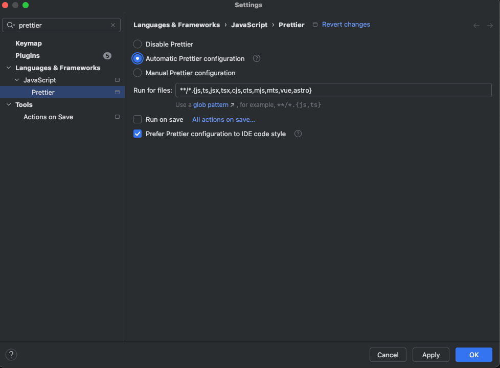

# React + TypeScript + Vite

이 템플릿은 Vite에서 React를 HMR(Hot Module Replacement)과 일부 ESLint 규칙으로 작동시키기 위한 최소한의 설정을 제공합니다.

현재 두 가지 공식 플러그인을 사용할 수 있습니다:

- [@vitejs/plugin-react](https://github.com/vitejs/vite-plugin-react/blob/main/packages/plugin-react)는 Fast Refresh를 위해 [Babel](https://babeljs.io/)을 사용합니다
- [@vitejs/plugin-react-swc](https://github.com/vitejs/vite-plugin-react/blob/main/packages/plugin-react-swc)는 Fast Refresh를 위해 [SWC](https://swc.rs/)를 사용합니다

## ESLint 설정 확장하기

프로덕션 애플리케이션을 개발하는 경우, 타입 인식 린트 규칙을 활성화하기 위해 다음과 같이 설정을 업데이트하는 것을 권장합니다:

```js
export default tseslint.config({
  extends: [
    // ...tseslint.configs.recommended을 제거하고 이것으로 대체하세요
    ...tseslint.configs.recommendedTypeChecked,
    // 더 엄격한 규칙을 원한다면 이것을 사용하세요
    ...tseslint.configs.strictTypeChecked,
    // 선택적으로 스타일 관련 규칙을 추가하려면 이것을 사용하세요
    ...tseslint.configs.stylisticTypeChecked,
  ],
  languageOptions: {
    // 다른 옵션들...
    parserOptions: {
      project: ['./tsconfig.node.json', './tsconfig.app.json'],
      tsconfigRootDir: import.meta.dirname,
    },
  },
})
```

React 관련 린트 규칙을 위해 [eslint-plugin-react-x](https://github.com/Rel1cx/eslint-react/tree/main/packages/plugins/eslint-plugin-react-x)와 [eslint-plugin-react-dom](https://github.com/Rel1cx/eslint-react/tree/main/packages/plugins/eslint-plugin-react-dom)을 설치할 수도 있습니다:

```js
// eslint.config.js
import reactX from 'eslint-plugin-react-x'
import reactDom from 'eslint-plugin-react-dom'

export default tseslint.config({
  plugins: {
    // react-x와 react-dom 플러그인 추가
    'react-x': reactX,
    'react-dom': reactDom,
  },
  rules: {
    // 다른 규칙들...
    // 권장 타입스크립트 규칙 활성화
    ...reactX.configs['recommended-typescript'].rules,
    ...reactDom.configs.recommended.rules,
  },
})
```


## WebStorm IDE에서 Prettier 설정 우선순위 적용하기



WebStorm IDE에서 Prettier 설정을 우선순위로 적용하는 방법은 다음과 같습니다:

1. **Prettier 플러그인 설치**
   - WebStorm의 `File > Settings > Plugins` 메뉴로 이동
   - Marketplace에서 "Prettier" 검색 후 설치

2. **Prettier 설정 파일 우선순위**
   - 프로젝트 루트에 `.prettierrc` 파일 생성 (이미 src/.prettierrc가 있는 경우 루트로 이동)
   - WebStorm은 다음 우선순위로 설정을 적용합니다:
     1. 프로젝트 루트의 `.prettierrc` 또는 `prettier.config.js`
     2. `package.json`의 "prettier" 필드
     3. WebStorm 기본 설정

3. **WebStorm에서 Prettier 활성화**
   - `File > Settings > Languages & Frameworks > JavaScript > Prettier` 메뉴로 이동
   - "Prettier package" 경로가 올바르게 설정되었는지 확인
   - "Run for files" 패턴에 `{**/*,*}.{js,ts,jsx,tsx,vue,astro,json,css,scss,md}` 추가
   - "On save" 옵션 활성화하여 저장 시 자동 포맷팅

4. **Prettier를 기본 포맷터로 설정**
   - `File > Settings > Editor > Code Style` 메뉴로 이동
   - "Scheme" 드롭다운에서 "Prettier" 선택

5. **키보드 단축키 설정**
   - `File > Settings > Keymap` 메뉴로 이동
   - "Prettier" 검색 후 "Reformat with Prettier" 액션에 원하는 단축키 할당 (예: Alt+Shift+P)

이 설정을 통해 WebStorm에서 Prettier가 다른 코드 스타일 설정보다 우선적으로 적용됩니다.

## Tailwind CSS 설정 및 사용하기

이 프로젝트는 최신 버전의 Tailwind CSS를 사용하여 스타일링을 구현합니다. Tailwind CSS는 유틸리티 우선 접근 방식의 CSS 프레임워크로, 클래스 이름을 직접 HTML 요소에 적용하여 스타일링합니다.

### 설치된 패키지

- `tailwindcss`: Tailwind CSS 코어 라이브러리
- `postcss`: CSS 변환 도구
- `autoprefixer`: 브라우저 호환성을 위한 CSS 접두사 자동 추가 도구

### 설정 파일

1. **tailwind.config.js**: Tailwind CSS의 주요 설정 파일
   ```js
   /** @type {import('tailwindcss').Config} */
   export default {
     content: [
       "./index.html",
       "./src/**/*.{js,ts,jsx,tsx}",
     ],
     theme: {
       extend: {},
     },
     plugins: [],
   }
   ```

2. **postcss.config.js**: PostCSS 설정 파일
   ```js
   export default {
     plugins: {
       tailwindcss: {},
       autoprefixer: {},
     },
   }
   ```

3. **src/index.css**: Tailwind 디렉티브 포함
   ```css
   @tailwind base;
   @tailwind components;
   @tailwind utilities;

   /* 기존 CSS 스타일 */
   ```

### Tailwind CSS 사용 방법

1. **기본 유틸리티 클래스 사용하기**
   ```jsx
   <div className="flex items-center justify-between p-4 bg-gray-100 rounded-lg">
     <h1 className="text-2xl font-bold text-gray-800">제목</h1>
     <button className="px-4 py-2 bg-blue-500 text-white rounded hover:bg-blue-600">
       버튼
     </button>
   </div>
   ```

2. **반응형 디자인**
   ```jsx
   <div className="w-full md:w-1/2 lg:w-1/3 p-4">
     {/* 모바일에서는 전체 너비, 태블릿에서는 절반, 데스크탑에서는 1/3 너비 */}
   </div>
   ```

3. **다크 모드**
   ```jsx
   <div className="bg-white dark:bg-gray-800 text-gray-900 dark:text-white">
     {/* 라이트 모드와 다크 모드에 따라 다른 스타일 적용 */}
   </div>
   ```

4. **상태 변형**
   ```jsx
   <button className="bg-blue-500 hover:bg-blue-700 focus:ring-2 focus:ring-blue-300">
     {/* 호버 및 포커스 상태에 따른 스타일 변경 */}
   </button>
   ```

자세한 내용은 [Tailwind CSS 공식 문서](https://tailwindcss.com/docs)를 참조하세요.
